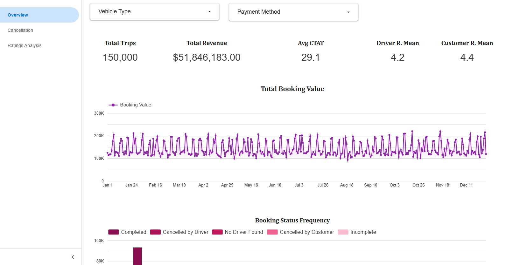

# Uber Rides Data Analysis & Interactive Dashboard

## Project Overview

This project performs an in-depth Exploratory Data Analysis (EDA) on a comprehensive Uber rides dataset. The primary goal is to uncover patterns and insights related to ride statuses, cancellation drivers, and user ratings.

The entire analysis culminates in a fully interactive dashboard built with Google's Looker Studio, providing a clear and dynamic way to explore the data.

---

## 🚀 Live Dashboard

### [>> View the Interactive Dashboard <<](https://lookerstudio.google.com/u/0/reporting/a23c8dc9-2de3-483b-ba2a-22a9161713e0/page/HwyZF)

---

### View the Original Dataset [Here](https://www.kaggle.com/datasets/yashdevladdha/uber-ride-analytics-dashboard).

---

## Tech Stack

- **Language:** Python
- **Libraries:** pandas, matplotlib, seaborn, plotly
- **BI Tool:** Google Looker Studio
- **Environment:** Jupyter Notebook

---

## How to Run This Project

To reproduce the analysis, follow these steps:

1.  **Clone the repository:**
    ```bash
    git clone https://github.com/henry-mesquita/uber-project.git
    cd uber-project
    ```
2.  **Install the required libraries:**
    ```bash
    pip install -r requirements.txt
    ```
3.  **Run the Jupyter Notebooks:**
    -   First, run `notebooks/extract.ipynb` to generate the clean dataset.
    -   Then, run `notebooks/eda.ipynb` to perform the analysis.

---

## Key Insights from the Analysis

1.  **Driver-Initiated Cancellations Dominate:** Drivers are responsible for the vast majority (~72%) of all cancellations, pointing to potential issues with driver satisfaction, logistics, or incentives.

2.  **Critical Data Gap in Cancellation Reasons:** A significant number of cancellations from both drivers and customers lack a recorded reason (`N/A`). This highlights a major gap in data collection that prevents deeper root cause analysis.

3.  **Consistent High Ratings:** Both customers and drivers maintain high average ratings (above 4.0), showing little variance across different vehicle types and payment methods. This suggests a generally positive user experience on completed trips.

---

## Dashboard Preview

Here is a screenshot of the main "Overview" page of the dashboard:


